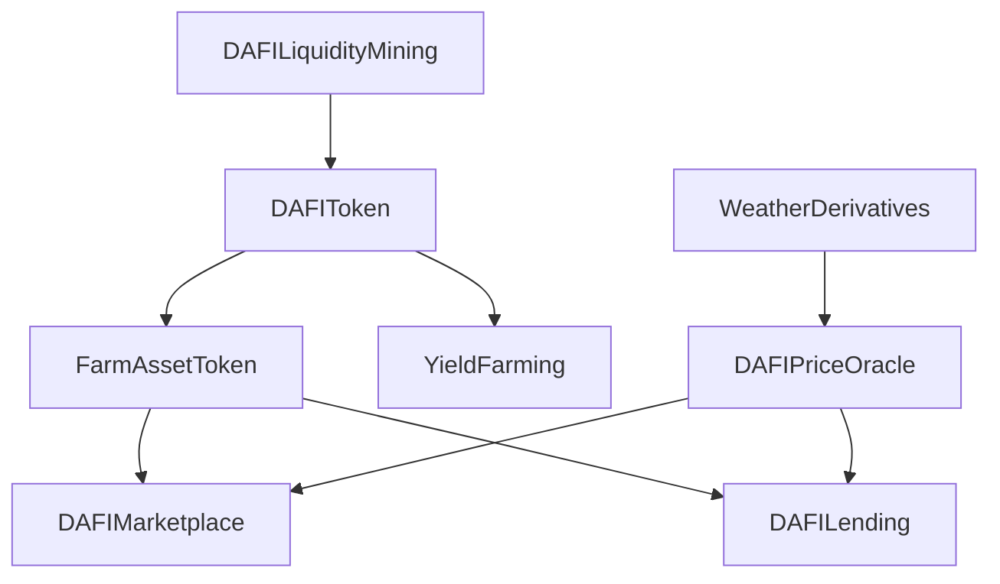

# DAFI (Decentralized Agricultural Finance Initiative) Technical Documentation

## Overview
DAFI is a comprehensive DeFi platform designed for agricultural finance, enabling farmers to access capital markets through asset tokenization, lending, and yield farming mechanisms.

## Smart Contract Architecture

### Core Contracts

#### 1. DAFIToken.sol
The base token contract implementing the platform's governance token.

**Key Features:**
- ERC20-compliant token
- Farmer verification system
- Reputation scoring
- Decentralized Identifier (DID) integration

**Main Functions:**
- `verifyFarmer`: Verify and register farmers on the platform
- `updateReputationScore`: Manage farmer reputation scores
- `mint/burn`: Token supply management

#### 2. FarmAssetToken.sol
ERC1155-based contract for tokenizing agricultural assets.

**Key Features:**
- Multiple asset type support (crops, livestock, land)
- Asset metadata management
- Insurance integration
- Maturity tracking

**Main Functions:**
- `tokenizeAsset`: Create new asset tokens
- `setInsurance`: Enable insurance for assets
- `updatePrice`: Modify asset prices
- `getAssetDetails`: Retrieve asset information

#### 3. DAFIMarketplace.sol
Handles the trading of tokenized agricultural assets.

**Key Features:**
- Order book system
- Price discovery mechanism
- Fee distribution
- Offer management

**Main Functions:**
- `createListing`: List assets for sale
- `makeOffer`: Place bids on assets
- `acceptOffer`: Complete trades
- `withdrawRewards`: Claim trading fees

### Advanced Features

#### 4. DAFILending.sol
Lending protocol for collateralized loans using agricultural assets.

**Key Features:**
- Dynamic interest rates
- Collateral management
- Liquidation mechanisms
- Reward distribution

**Main Functions:**
- `createLoan`: Initiate a loan
- `repayLoan`: Repay outstanding loans
- `liquidateLoan`: Handle defaulted loans
- `calculateInterest`: Determine loan interest

#### 5. WeatherDerivatives.sol
Smart contract for weather-based risk management.

**Key Features:**
- Temperature-based triggers
- Premium calculation
- Automated payouts
- Oracle integration

**Main Functions:**
- `createWeatherContract`: Create weather derivatives
- `checkAndTriggerContract`: Verify conditions and execute payouts
- `expireContract`: Handle contract expiration

#### 6. YieldFarming.sol
Implements yield farming and staking mechanisms.

**Key Features:**
- Multiple pool support
- Reward distribution
- Staking mechanisms
- Emergency withdrawal

**Main Functions:**
- `stake`: Deposit tokens for farming
- `withdraw`: Remove staked tokens
- `claimRewards`: Harvest farming rewards
- `calculateRewards`: Compute earned rewards

#### 7. DAFIPriceOracle.sol
Provides reliable price feeds for agricultural assets.

**Key Features:**
- Multi-source price aggregation
- Chainlink integration
- Confidence scoring
- Deviation thresholds

**Main Functions:**
- `submitPrice`: Update asset prices
- `getPrice`: Retrieve current prices
- `addTrustedSource`: Manage price sources
- `calculateDeviation`: Monitor price changes

#### 8. DAFILiquidityMining.sol
Advanced liquidity mining with boosted rewards.

**Key Features:**
- Time-locked staking
- Boost multipliers
- Dynamic reward rates
- Pool allocation

**Main Functions:**
- `deposit`: Stake LP tokens
- `withdraw`: Remove staked tokens
- `calculateBoost`: Determine reward multipliers
- `pendingReward`: View unclaimed rewards

### System Integration

#### Contract Dependencies


## Security Features

1. **Access Control**
   - Role-based permissions
   - Multi-signature requirements
   - Time-locked operations

2. **Risk Management**
   - Collateral requirements
   - Liquidation thresholds
   - Price deviation limits

3. **Emergency Procedures**
   - Circuit breakers
   - Emergency withdrawals
   - Governance interventions

## Deployment Guide

1. Deploy core contracts in order:
   ```
   1. DAFIToken
   2. DAFIPriceOracle
   3. FarmAssetToken
   4. DAFIMarketplace
   ```

2. Deploy feature contracts:
   ```
   5. DAFILending
   6. WeatherDerivatives
   7. YieldFarming
   8. DAFILiquidityMining
   ```

3. Configure contract parameters:
   - Set trusted price sources
   - Initialize pool parameters
   - Configure governance settings

## Integration Guidelines

### External Integrations
- Chainlink price feeds
- Weather data oracles
- IPFS for metadata storage
- Cross-chain bridges

### API Endpoints
- Asset tokenization
- Trading interface
- Lending operations
- Price feed access

## Best Practices

1. **Security**
   - Regular audits
   - Bug bounty program
   - Rate limiting
   - Secure upgrades

2. **Performance**
   - Gas optimization
   - Batch processing
   - Event monitoring
   - State management

3. **Maintenance**
   - Version control
   - Documentation updates
   - Community feedback
   - Regular updates

## Future Developments

1. **Planned Features**
   - Cross-chain integration
   - Advanced derivatives
   - AI-powered risk assessment
   - Mobile app integration

2. **Research Areas**
   - Zero-knowledge proofs
   - Layer 2 scaling
   - Automated market making
   - Sustainable farming incentives
